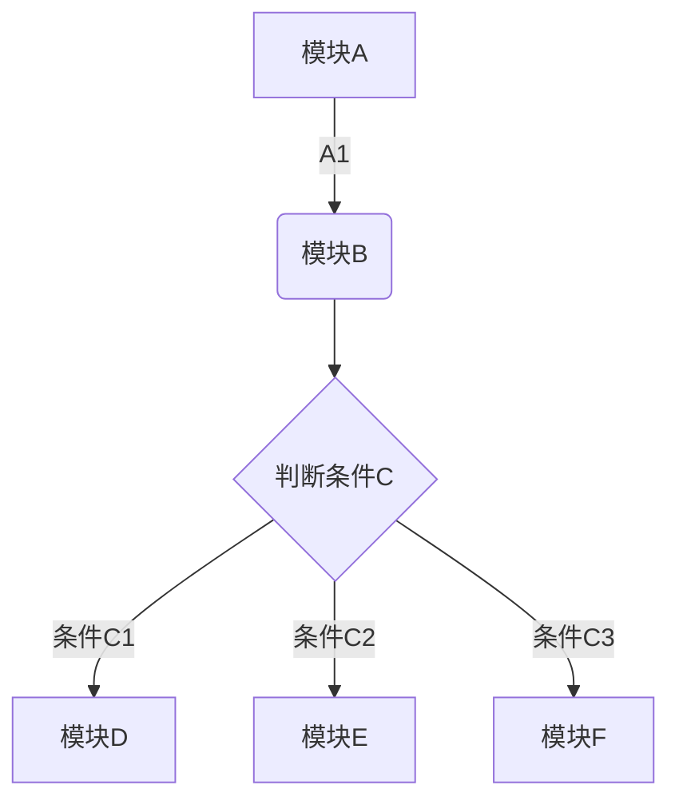
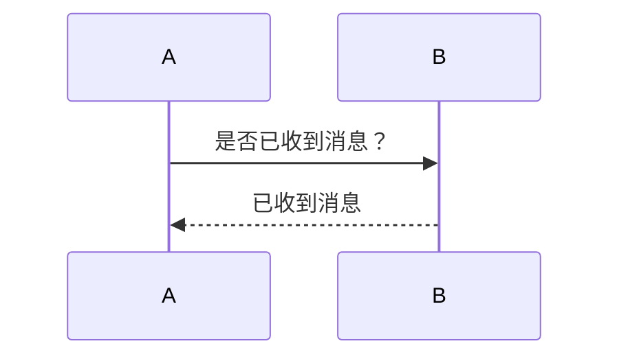
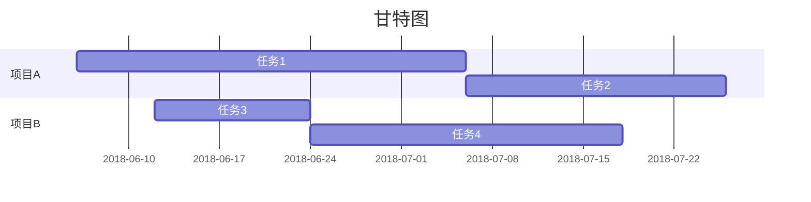

# hello_world
># <u>Markdown</u> ~~整理~~*笔记*

## 打井号+空格=编辑本行的字体
### 2.几个#就是几号字体
##### **3.加粗字体两个星，再打两个就是结束**    后面的不加粗
##### *4.一个星是斜体*    用法同上
##### <u>5. u 标签(underline吧)是下画线</u>
##### ~~6. 两个是删除线，用法同3~~ 
*** 
***
>#### 7.连着三个星分隔符,可以看到上面两条线
>##### 8.加尖括号是引用

#### 9. 分点标记->
* 10.一个星再加空格就好，*不加空格是斜体,记得标记结束*
* **两个星不就是加粗了嘛**
* [x] 这样是一个已勾选的复选框的样子
* [X] 是用方括号和字母X组成的，大小写不敏感
* [ ] 中间打空格就不勾选。
* [d] 只有字符X，不然就是普通的分点。

+ 加号也是分点
    + 是这样的
    + 用法一样
        + 可以分几层显示
* 暗度
    * 爱上的惠顾
    * 祭扫牛顿环
+ 都可以
>### 11.插入网页链接[百度](www.baidu.com)
>方括号里写[链接名字](后面接圆括号打url)
***
>#### 12.插入图片 @w=100h=50
>也可以插入网页图片 用法是链接里面打image 前加感叹号!
@w=300h=100

#
发现单独打一个#也会有分割线的效果~
***

#### 13.添加表格

| 这格式有点厉害的 |列1   |列二  |列三  |
| --- | --- | --- | --- |
| 行1 | 应该可以自动填充16546546 |  |  |
| 行2 |  | 还行，有点像矩阵 |  |
|点击| 添加表格 |就可以选择 |想要的大小了 | 这里多了是没用的，因为没定义列| 

#### 14.插入图表
```chart
,Budget,Income
June,5000,8000
July,3000,1000

type: bar
title: 表格标题
x.title: X轴坐标
y.title: Y轴坐标
y.suffix: （坐标值后缀）
x.suffix: 个
```
~~这个一般谁在这里面写表格啊....都是画好了之后贴图片吧喂~~


### 15.代码块
```python
#!/usr/bin/python
import re

line = "Python is the best langage in the world "
matchObj = re.match( r'(.*) are (.*?) .*', line, re.M|re.I)
```
```java
public static void main(){
System.out.printf("This is a java project");
}
```
```C
#include stduio
int main(){
    print("I almost forgot my C langage");
    ruturn 0;
}
```

#### 16.数学公式[输入指南](https://katex.org/docs/supported.html)
```math
S=\pi*r*r=
\sum_{\mathclap{1\le i\le j\le n}} x_{ij}
```
```math
\Overrightarrow{AB}
=\overbrace{a+b+c}^{\text{note}}

```

#### 17.流程图，时序图，甘特图




#### what`s more 

[TOC] 索引
相当于目录啦，会自动更新还是很厉害的
***
***
***
>## 来源[印象笔记入门指南](https://list.yinxiang.com/markdown/eef42447-db3f-48ee-827b-1bb34c03eb83.php)
>撒花✿✿ヽ(°▽°)ノ✿
